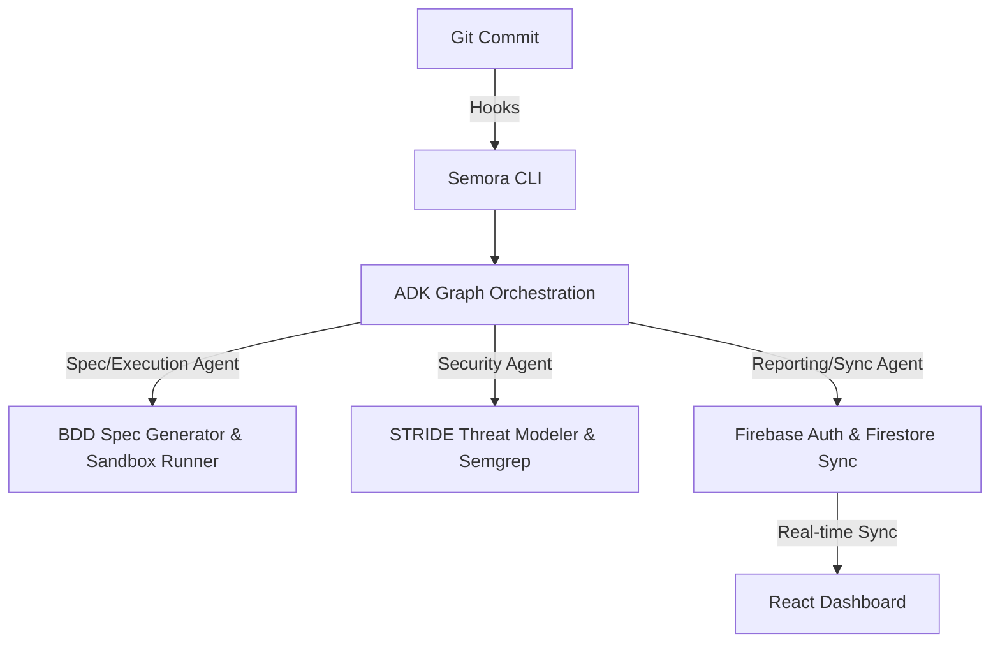

# Semora Master Plan

Semora is an autonomous, local CI/quality-gate tool designed to intercept git commits, automatically generate and run BDD tests in a secure sandbox, perform STRIDE threat modeling, and synchronize audit reports to a Firebase-hosted web dashboard.

---

## 1. System Architecture

### Components:
1.  **Git Hook Interceptor**: Activates Semora on a pre-commit event.
2.  **ADK Graph Workflow**: Orchestrates agents (Spec, Execution, Security, Sync).
3.  **Sandbox Executor**: Safely runs BDD test suites (`pytest-bdd`) using mock/sandboxed inputs.
4.  **Security Threat Modeler**: Audits code diffs for security violations (STRIDE rules).
5.  **Firebase Synchronization**: Signs in securely using REST APIs and writes execution results to Firestore.
6.  **Web Dashboard**: A React + Vite dashboard displaying compliance history, live feed, audit logs, and test matrix.

---

## 2. Agent Assignments

*   **Scaffold Agent**: Manages codebase layout, conventions, packaging, and configurations.
*   **ADK Graph Agent**: Implements orchestrator state-machine logic.
*   **Spec & Execution Agent**: Generates BDD feature files and executes tests.
*   **Security Agent**: Implements STRIDE modeling and security scanning wrappers.
*   **Reporting & Sync Agent**: Manages local Markdown reports, Firebase Authentication, and Firestore sync.
*   **Frontend Agent**: Develops the React-based visual dashboard.
